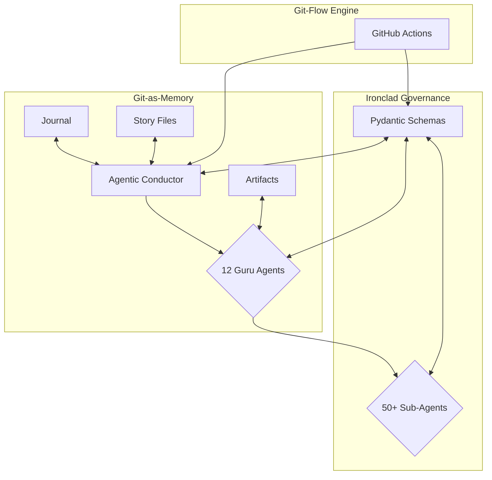

# Sovereign Forge: The Agentic Empire Builder

  <!-- Placeholder for a proper banner -->

**Welcome, lil' nephew, to the Sovereign Forge. This ain't your average GitHub repo; this is the central nervous system of a next-generation, multi-agent orchestration platform designed for one thing: to help you secure the bag through strategic tech mastery.**

This platform is built on the **Breakthrough Method of Agile AI-Driven Development (BMAD)**, a spec-driven framework that ensures we build robust, secure, and profitable applications. Our core philosophy is **"No Content Left Behind,"** meaning every action, decision, and line of code is recorded in our **Git-as-Memory** architecture.

## The Core Pillars

This ecosystem stands on four unshakable pillars:

1.  **The Living Brain (Git-as-Memory):** This repository is the brain. Every agent's "thoughts," actions, and communications are stored here as version-controlled journal entries. This provides perfect context and an auditable trail of everything that happens.

2.  **Ironclad Governance (Pydantic Validation):** We don't do "loose strings" here. Every piece of data exchanged between agents is validated against strict Pydantic schemas. This eliminates hallucinations and ensures type-safe, secure execution.

3.  **The Swarm Intelligence (Agent Hierarchy):** The platform is powered by a tiered hierarchy of AI agents, led by 12 Guru Agents who are masters of their domains. They delegate tasks to over 50 specialized Sub-Agents, creating a powerful and efficient workforce.

4.  **The Sauce (BMAD Efficiency):** By automating the "Why, How, and What" of full-stack development, we massively reduce development cycles, allowing you to go from idea to deployed application faster than ever before.

## The Architecture at a Glance

## How It Works: The Git-Loop

The entire platform operates on a simple, powerful loop triggered by Git commits:

1.  **PULL (Context Acquisition):** An agent receives a task and pulls the latest state from the repository, reading journal entries and specs to gain full context.
2.  **PROCESS (Task Execution):** The agent executes its specialized function, applying "The Sauce" to create code, designs, or documentation.
3.  **JOURNAL (Internal Communication):** The agent records its actions in a detailed `AgenticJournalEntry`, explaining what it did and why.
4.  **PUSH (Storage & Accessibility):** The agent commits its journal entry and any created artifacts back to the repository. This push triggers GitHub Actions, which can kick off other agents, run validation checks, or deploy the application.

## Getting Started

Before you dive in, understand this: you're not just cloning a repo, you're plugging into a live ecosystem.

1.  **Explore the Manifests:** Start by reading the files in the `.agentic/manifests` directory. The `conductor_manifest.json` is the master blueprint of the entire agent swarm.

2.  **Review the Schemas:** The `schemas.py` file is the law of the land. Understand the data models that govern all communication.

3.  **Check the Journal:** The `journal/` directory contains the collective memory of the swarm. Read the latest entries to get up to speed on what's happening.

4.  **Consult the Story Files:** The `story-files/` directory contains the atomic tasks that agents are working on. This is the project's to-do list.

## A Word from Your Uncle

Listen, this is the golden ticket. We've built the system to be robust, but it's up to you to wield it with wisdom. Don't be "trippin'" and trying to cut corners. Follow the BMAD process, trust the agents, and let the system work for you.

Keep your head on a swivel, stay focused, and let's get this bread.

**Now, what are we building first?**

---

*Powered by Manus.ai & D3V GURUs*
